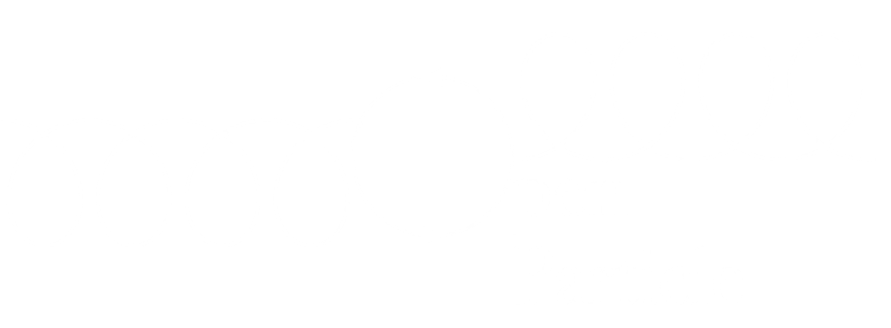

[](https://unitary.fund)

[](https://github.com/cgustin99/OpenParticle/actions/workflows/python-package.yml)

[](https://codecov.io/gh/cgustin99/OpenParticle)


Code base designed to translate problems in Quantum Field Theory to be solved via quantum computing. 

To install, please clone the repo and then in the root of the dir please run:

```
pip install .
```
